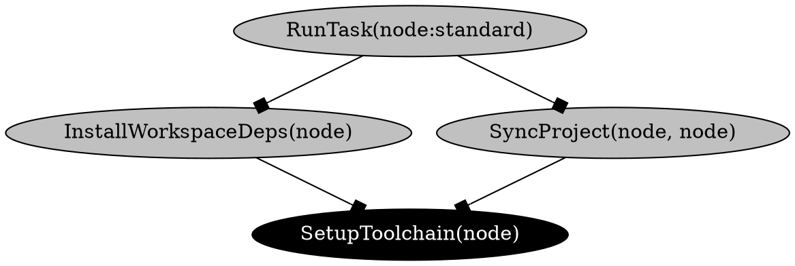

import VersionLabel from '@site/src/components/Docs/VersionLabel';

<VersionLabel version="1.15.0" header />

The `moon action-graph [target]` (or `moon ag`) command will generate and serve a visual graph of
all actions and tasks within the workspace, known as the
[action graph](../how-it-works/action-graph). In other tools, this is sometimes referred to as a
dependency graph or task graph.

```shell
# Run the visualizer locally
$ moon action-graph

# Export to DOT format
$ moon action-graph --dot > graph.dot
```

> A target can be passed to focus the graph, including dependencies _and_ dependents. For example,
> `moon action-graph app:build`.

### Arguments

- `[target]` - Optional target to focus.

### Options

- `--dependents` - Include dependents of the focused target.
- `--dot` - Print the graph in DOT format.
- `--host` - The host address. Defaults to `127.0.0.1`. <VersionLabel version="1.36.0" />
- `--json` - Print the graph in JSON format.
- `--port` - The port to bind to. Defaults to a random port. <VersionLabel version="1.36.0" />

### Configuration

- [`runner`](../config/workspace#runner) in `.moon/workspace.yml`
- [`tasks`](../config/tasks#tasks) in `.moon/tasks.yml`
- [`tasks`](../config/project#tasks) in `moon.yml`

## Example output

The following output is an example of the graph in DOT format.


