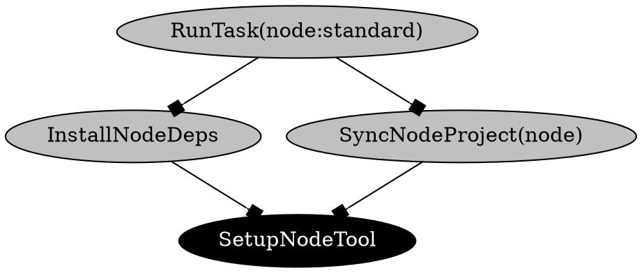

The `moon action-graph [target]` (or `moon ag`) command will generate and serve a visual graph of
all actions and tasks within the workspace, known as the
[action graph](../how-it-works/action-graph). In other tools, this is sometimes referred to as a
dependency graph or task graph.

```shell
# Run the visualizer locally
$ moon action-graph

# Export to DOT format
$ moon action-graph --dot > graph.dot
```

> A target can be passed to focus the graph, including dependencies _and_ dependents. For example,
> `moon action-graph app:build`.

### Arguments

- `[target]` - Optional target to focus.

### Options

- `--dot` - Output the graph in DOT format.

## Example output

The following output is an example of the graph in DOT format.


