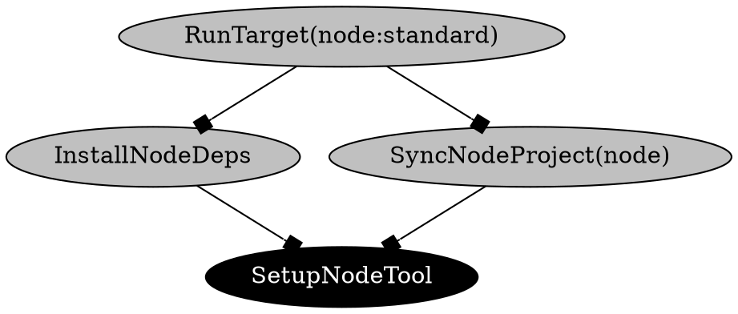

import VersionLabel from '@site/src/components/Docs/VersionLabel';

<VersionLabel header version="0.7" />

The `moon dep-graph [target]` (or `moon dg`) command will generate a dependency graph of all
actions, targets, and tasks within the workspace, and will output the graph in
[Graphviz DOT format](https://graphviz.org/doc/info/lang.html). This output can then be used by any
tool or program that supports DOT, for example, this
[live preview visualizer](https://dreampuf.github.io/GraphvizOnline).

In the future we aim to replace this with an interactive visualizer.

```shell
$ moon dep-graph > graph.dot
```

> A target can be passed to focus the graph, including dependencies _and_ dependents. For example,
> `moon dep-graph app:build`.

### Arguments

- `[target]` - Optional target to focus.

## Example output

The following output is an example of the graph in DOT format.


