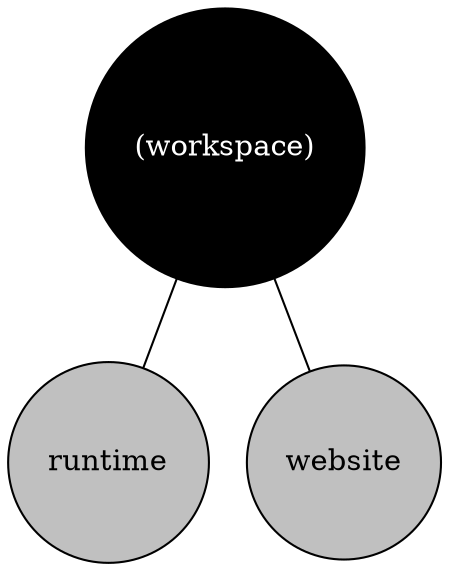

The `moon project-graph [name]` (or `moon pg`) command will generate a graph of all configured
projects, with edges between dependencies, and will output the graph in
[Graphviz DOT format](https://graphviz.org/doc/info/lang.html). This output can then be used by any
tool or program that supports DOT, for example, this
[live preview visualizer](https://dreampuf.github.io/GraphvizOnline).

In the future we aim to replace this with an interactive visualizer.

```shell
$ moon project-graph > graph.dot
```

> A project name can be passed to focus the graph to only that project and it's dependencies. For
> example, `moon project-graph app`.

### Arguments

- `[name]` - Optional name of a project to focus, as defined in
  [`projects`](../config/workspace#projects).

## Example output

The following output is an example of the graph in DOT format.


