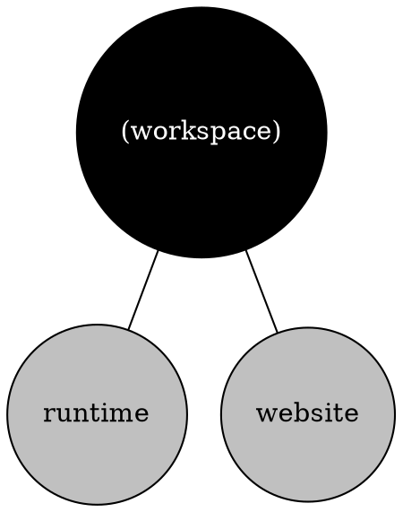

The `moon project-graph [name]` (or `moon pg`) command will generate and serve a visual graph of all
configured projects as nodes, with dependencies between as edges, and can also output the graph in
[Graphviz DOT format](https://graphviz.org/doc/info/lang.html).

```shell
# Run the visualizer locally
$ moon project-graph

# Export to DOT format
$ moon project-graph --dot > graph.dot
```

> A project name can be passed to focus the graph to only that project and it's dependencies. For
> example, `moon project-graph app`.

### Arguments

- `[name]` - Optional name or alias of a project to focus, as defined in
  [`projects`](../config/workspace#projects).

### Options

- `--dot` - Output the graph in DOT format.

## Example output

The following output is an example of the graph in DOT format.


