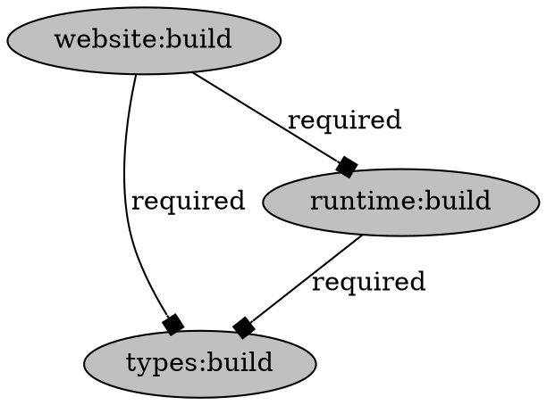

import VersionLabel from '@site/src/components/Docs/VersionLabel';

<VersionLabel version="1.30.0" header />

The `moon task-graph [target]` (or `moon tg`) command will generate and serve a visual graph of all
configured tasks as nodes, with dependencies between as edges, and can also output the graph in
[Graphviz DOT format](https://graphviz.org/doc/info/lang.html).

```shell
# Run the visualizer locally
$ moon task-graph

# Export to DOT format
$ moon task-graph --dot > graph.dot
```

> A task target can be passed to focus the graph to only that task and its dependencies. For
> example, `moon task-graph app:build`.

### Arguments

- `[target]` - Optional target of task to focus.

### Options

- `--dependents` - Include direct dependents of the focused task.
- `--dot` - Print the graph in DOT format.
- `--json` - Print the graph in JSON format.

## Example output

The following output is an example of the graph in DOT format.


